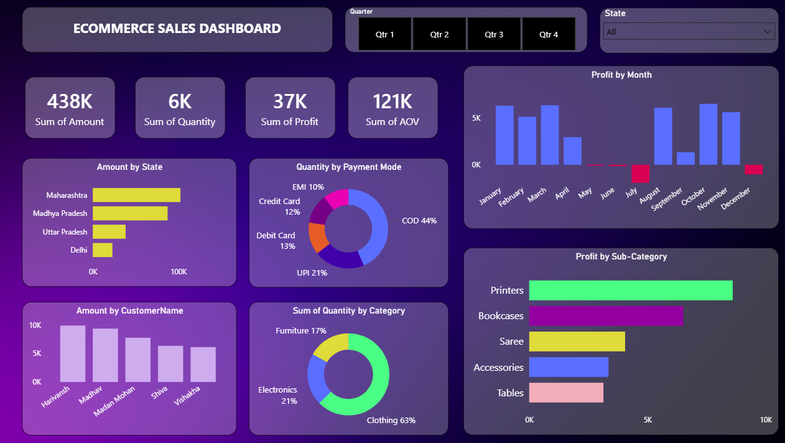

Ecommerce Sales Dashboard

A comprehensive Power BI dashboard designed to track and analyze ecommerce sales performance, providing insights into profitability, customer behavior, and regional trends.

🚀 Project Overview

This project transforms raw ecommerce data into an interactive visual report. It allows stakeholders to monitor key performance indicators (KPIs) and dive deep into sales metrics across various dimensions like geography, payment methods, and product categories.

📊 Key Features \& Insights

KPI Tracking: High-level overview of total sales amount (438K), quantity sold (6K), total profit (37K), and Average Order Value (121K).

Profitability Analysis: A monthly breakdown of profit to identify seasonal trends and high-performing periods.

Regional Performance: Analysis of sales amount by state, highlighting top-performing regions like Maharashtra and Madhya Pradesh.

Customer Insights: Top customers identified by total purchase amount.

Operational Metrics: Breakdown of quantity sold by payment mode (with COD and UPI as major drivers) and product category.

Sub-Category Deep Dive: Visual representation of profit generated by specific items like Printers and Bookcases.

📁 Data Structure

The analysis is powered by two primary datasets:

Orders: Contains high-level transaction data.

Details: Provides granular information on the items within those orders.

🛠️ Tech Stack

Tool: Power BI Desktop

Data Source: CSV Files

Data Modeling: Created relationships between Orders and Details tables for cohesive reporting.

Visualizations: Bar charts, Donut charts, Line/Column combos, and Slicers for interactivity.

💡 How to Use

Download the .pbix file.

Open it in Power BI Desktop.

Use the Quarter and State slicers at the top to filter the data and explore specific segments.

